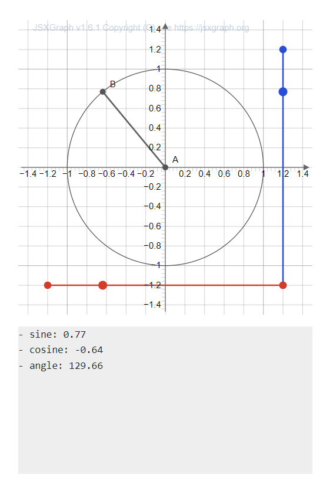

# A Math Visualization Project

- Built with [Next.js](https://nextjs.org/), [JSXGraph](https://jsxgraph.uni-bayreuth.de/wp/index.html), and [Django REST Framework](https://www.django-rest-framework.org/)
- Deployed to production with CircleCI
- Live site can be found at [www.mathvisualized.dev](https://www.mathvisualized.dev/)

Copyright and maintainer: [Maija Kekkonen](https://mkkekkonen.github.io/)
